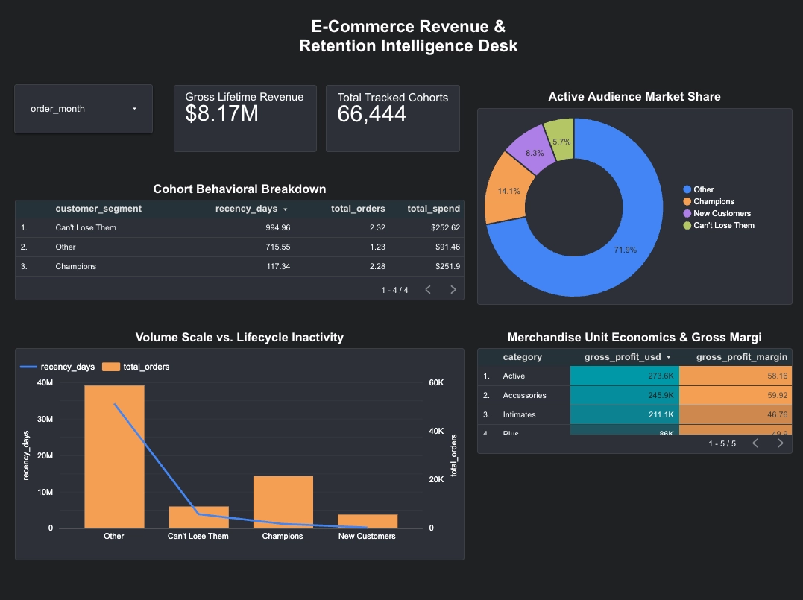

# 🛒 E-Commerce Revenue & Retention Intelligence Engine

A BigQuery + Looker Studio analytics project that turns raw transactional retail data into cohort retention, RFM segmentation, and unit-economics dashboards for executive reporting.

[](https://datastudio.google.com/reporting/328cfb64-a1c7-4128-a08b-e13aedafdc89)
[](./sql)
[](./LICENSE)



---

## Contents

- [Overview](#overview)
- [Live Dashboard](#live-dashboard)
- [Architecture](#architecture)
- [Dashboard Breakdown](#dashboard-breakdown)
- [SQL Views](#sql-views)
- [Tech Stack](#tech-stack)
- [Repository Structure](#repository-structure)
- [Getting Started](#getting-started)
- [License](#license)

---

## Overview

This project processes multi-million-row transactional data (theLook eCommerce dataset) into modular analytical layers that:

- Quantify **customer retention lifecycles** via cohort decay curves
- Isolate **high-value customer segments** using RFM (Recency, Frequency, Monetary) scoring
- Map **unit economics** to surface which product categories actually drive profit

Heavy analytical logic is compiled once into permanent BigQuery **views**, so the dashboard queries stay fast and cheap instead of re-scanning raw tables on every load.

## Live Dashboard

**[→ Open the live Looker Studio dashboard](https://datastudio.google.com/reporting/328cfb64-a1c7-4128-a08b-e13aedafdc89)**

A static preview is embedded above for anyone without dashboard access; the link gives the full interactive version (cross-filtering, date controls, drill-downs).

## Architecture

```
Raw Transactional Tables (theLook eCommerce)
        │
        ▼
Google BigQuery (Cloud Data Warehouse)
        │
        ▼
Custom Analytical Views (Star Schema / CTEs / Window Functions)
   ├── v_customer_rfm_segments        → Recency, Frequency, Monetary scoring matrix
   ├── v_customer_cohort_retention    → Windowed month-over-month cohort decay
   └── v_product_profit_margins      → Product-level margins & gross profitability
        │
        ▼
Looker Studio (BI layer, blended schema, native cross-filtering)
```

## Dashboard Breakdown

**Executive summary row**
- **Gross Lifetime Revenue — $8.17M**: total consumer spend, formatted for executive readability
- **Total Tracked Cohorts — 66,444**: distinct customer count processed by the platform

**Behavioral & market share**
- **Cohort Behavioral Breakdown (table)** — average recency, order frequency, and spend per segment, e.g. *Champions* average 117 days recency vs. *Can't Lose Them* at 995 days
- **Active Audience Market Share (donut)** — segment mix: Champions 14.1%, New Customers 8.3%, Can't Lose Them 5.7%, Other 71.9%. Built with native cross-filtering — clicking a slice filters every other chart on the page to that segment

**Operational & unit economics**
- **Volume Scale vs. Lifecycle Inactivity (dual-axis combo chart)** — orange bars show order volume per segment against a blue recency line; makes the point that "Other" has the highest order volume but also the highest churn risk (~994 days average recency)
- **Merchandise Unit Economics & Gross Margins (heatmap table)** — profit and margin % by category; Accessories currently leads at 59.92% gross margin

## SQL Views

| File | Purpose |
|---|---|
| `sql/customer_rfm_segments.sql` | Scores users 1–5 on recency/frequency/monetary using `NTILE(5) OVER (ORDER BY ...)`, then buckets scores into named segments via `CASE WHEN` |
| `sql/customer_cohort_retention.sql` | Uses `MIN(created_at) OVER (PARTITION BY user_id)` to anchor each user's cohort month, then tracks retention decay with `DATE_DIFF` |
| `sql/product_profit_margins.sql` | Joins sales records to item cost data to compute true gross margin, excluding cancelled/failed orders |

## Tech Stack

- **Data Warehouse**: Google BigQuery
- **BI / Visualization**: Google Looker Studio
- **SQL techniques**: CTEs, window functions, `NTILE` quantiles, conditional aggregation, relational joins

## Repository Structure

```
ecommerce-revenue-retention-intelligence/
├── README.md
├── LICENSE
├── docs/
│   └── images/
│       └── dashboard-preview.png     ← screenshot rendered at the top of this README
├── sql/
│   ├── customer_rfm_segments.sql
│   ├── customer_cohort_retention.sql
│   └── product_profit_margins.sql
└── data/
    └── (optional) sample extracts or dbt/BigQuery config
```

> **Where the dashboard itself lives:** Looker Studio dashboards are hosted by Google, not stored as a file in your repo — you can't "commit" the interactive dashboard. What goes in the repo is (1) the **link** to it (the badge + Live Dashboard section above) and (2) a **static screenshot** for anyone browsing the repo without dashboard access. Put that screenshot at `docs/images/dashboard-preview.png`, matching the path already referenced above — GitHub will render it automatically at the top of this README.

## Getting Started

1. **Clone the repo** and open a BigQuery project (or reuse an existing one with the `theLook eCommerce` public dataset).
2. **Create the views** by running each script in `sql/` against your dataset, in this order: `customer_rfm_segments.sql` → `customer_cohort_retention.sql` → `product_profit_margins.sql`.
3. **Connect Looker Studio** to the resulting views as a BigQuery data source, or just open the [live dashboard link](https://datastudio.google.com/reporting/328cfb64-a1c7-4128-a08b-e13aedafdc89) if you only need to view it.
4. **(Optional) Make a copy** of the Looker Studio report if you want to point it at your own BigQuery project instead of the original data source.

## License

Add a `LICENSE` file to the repo root (MIT is a reasonable default for a portfolio/analytics project) — the badge above already links to it.
